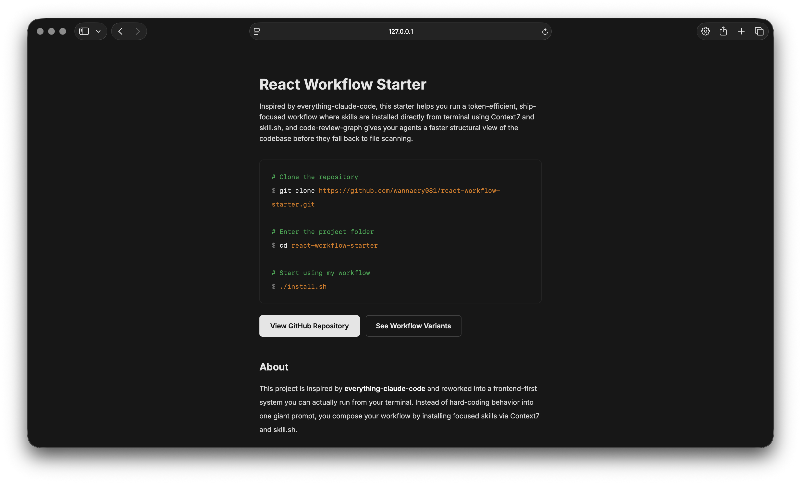

# React Workflow Starter



A practical starter for building a disciplined AI-assisted frontend workflow across Claude, Codex, OpenCode, and GitHub Copilot. It gives every agent the same operating model, command lifecycle, project standards, and review-first context through `code-review-graph`.

Instead of relying on one long prompt that drifts over time, this repository organizes the workflow into reusable instructions, command definitions, skills, task folders, and compatibility wrappers that can travel with your project.

## Why This Exists

Modern AI development works best when the agent has clear constraints, repeatable workflows, and fast access to structural code context. React Workflow Starter provides that baseline so planning, implementation, testing, review, and commits happen in a consistent way no matter which coding assistant is driving the work.

Use it when you want:

- Shared agent behavior across Claude, Codex, OpenCode, and Copilot
- A repeatable `Ask -> Plan -> Todo -> Implement -> Test -> Commit` lifecycle
- Repo-local skills for React, Next.js, Supabase, Convex, Tailwind, Zustand, and shadcn/ui
- `code-review-graph` guidance for faster impact analysis and review context
- Task artifacts that stay visible in `docs/tasks`
- A portable workflow foundation you can adapt to real frontend projects

## Quick Start

```bash
git clone https://github.com/wannacry081/react-workflow-starter.git
cd react-workflow-starter
./install.sh
```

The installer is designed to move the workflow files into the parent project folder and remove the starter wrapper files. Review `install.sh` first if you want to customize how the files are copied into an existing repository.

## What You Get

| Area                    | Included                                                           |
| ----------------------- | ------------------------------------------------------------------ |
| Shared instructions     | `AGENTS.md`, `CLAUDE.md`, `INSTRUCTIONS.md`, Copilot guidance      |
| Workflow commands       | `ask`, `plan`, `todo`, `implement`, `test`, `commit`, `bug`, `tdd` |
| Canonical command logic | `.ai/commands/*.md`                                                |
| Agent skills            | `.agents/skills/*` with stack-specific workflows                   |
| Compatibility wrappers  | Claude commands, OpenCode commands, Copilot prompts                |
| Task lifecycle          | `docs/tasks/todo`, `in-progress`, `done`, and `plan`               |
| Review context          | `code-review-graph` instructions and configuration                 |

## Workflow

The starter is built around a simple delivery loop:

1. **Ask** - refine unclear requests into a tighter prompt.
2. **Plan** - create an implementation-ready plan with acceptance criteria.
3. **Todo** - turn the plan into an executable checklist.
4. **Implement** - complete one todo file end to end.
5. **Test** - generate or run validation based on the task.
6. **Commit** - create atomic Conventional Commits from active changes.

This keeps work visible and reviewable. Plans live in `docs/tasks/plan`, active tasks start in `docs/tasks/todo`, and completed task records move to `docs/tasks/done`.

## Code Review Graph

This repository is configured for graph-first exploration with `code-review-graph`.

Official site: <https://code-review-graph.com/>

Install requirements:

- Python 3.12 or higher is required.
- Install `code-review-graph` as an isolated CLI with `pipx`.

```bash
python3.12 --version
brew install pipx
pipx ensurepath
pipx install code-review-graph
```

Recommended usage:

```bash
code-review-graph build
code-review-graph update
```

Agents should use the graph before broad file scans when they need to:

- Find relevant functions, classes, and modules
- Understand callers, callees, imports, and dependents
- Check impact radius before editing
- Review changed files with targeted context
- Locate nearby tests and affected execution paths

File scanning is still useful, but it should be the fallback when graph data is incomplete or unavailable.

## Project Structure

```text
.
├─ AGENTS.md
├─ CLAUDE.md
├─ INSTRUCTIONS.md
├─ install.sh
├─ index.html
├─ assets/
│  └─ react-workflow-site.png
├─ .ai/
│  ├─ commands/
│  ├─ config/
│  └─ references/
├─ .agents/
│  └─ skills/
├─ .claude/
│  ├─ commands/
│  └─ skills/
├─ .github/
│  ├─ copilot-instructions.md
│  └─ prompts/
├─ .opencode/
│  └─ commands/
└─ docs/
   └─ tasks/
      ├─ plan/
      ├─ todo/
      ├─ in-progress/
      └─ done/
```

## Stack Standards

The shared instructions are tuned for modern frontend work:

- **Framework:** Next.js App Router, React, and TypeScript
- **UI:** shadcn/ui, Tailwind CSS v4, coss, motion-primitives, and framer-motion
- **State:** Zustand for shared client state, React state for local UI state
- **Data fetching:** TanStack Query for server state, native `fetch` or API routes for one-off calls
- **Backend:** Supabase for auth and CRUD-heavy apps, Convex for real-time features
- **AI:** Vercel AI SDK for streaming and provider-agnostic orchestration
- **Validation:** Zod at forms, API routes, query params, and tool boundaries

The conventions are documented in `AGENTS.md` so each tool can follow the same project expectations.

## TDD Mode

Workflow behavior can read:

```text
.ai/config/workflow-mode.md
```

Supported values:

```md
TDD_MODE: on
TDD_MODE: off
```

The default is `off`. Turn it on when you want new behavior to be driven by tests first.

## Source Of Truth

When instructions overlap, resolve behavior in this order:

1. `.ai/commands/*.md`
2. `AGENTS.md`
3. `.github/copilot-instructions.md`
4. `INSTRUCTIONS.md`

This keeps the command workflow canonical while still allowing platform-specific wrappers where needed.

## Related Workflow Starters

- [NestJS Workflow Starter](https://github.com/wannacry081/nestjs-workflow-starter)
- [React Native Workflow Starter](https://github.com/wannacry081/react-native-workflow-starter)
- [Flutter Workflow Starter](https://github.com/wannacry081/flutter-workflow-starter)

## Contributing

Keep the workflow centralized and avoid duplicating behavior across tools unless a platform requires its own format.

- Put shared project standards in `AGENTS.md`.
- Keep command behavior in `.ai/commands`.
- Keep task templates in `.ai/references`.
- Keep Copilot-only guidance in `.github/copilot-instructions.md`.
- Keep repo-local skills in `.agents/skills`.
